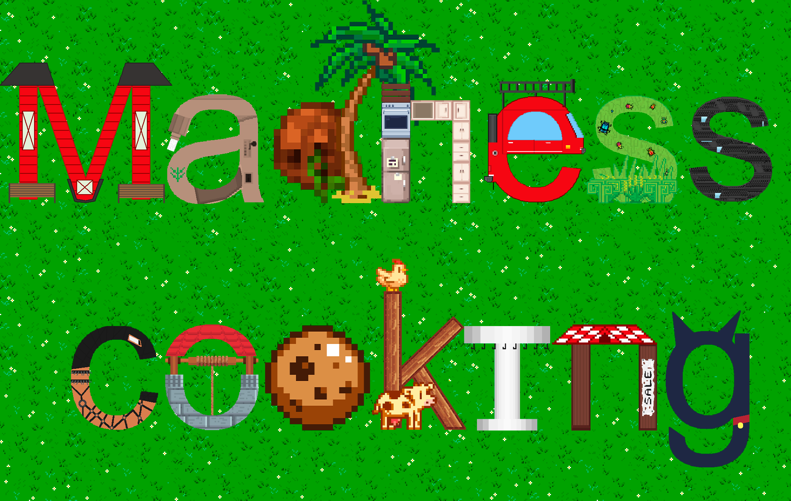

<p align="center"></p>

# Madness Cooking
Данная версия моей первой игры изначально предназначалась для выхода в Google Play. Но тогда я не смог зарегистрироваться в Play Console, а сейчас для меня это не 
столь важно (я вообще не уверен, можно ли сейчас из России загружать игры в Google Play), так что данная версия так и останется неопробованной. На ней было потрачено
2 тысячи рублей и один аккаунт Майкрософт. Если вы хотите подробнее узнать об истории создания самой игры или о её геймплее, переходите в репозитории
[английской версии](https://github.com/Nytrock/Madness_Cooking_EN) и [русской версии](https://github.com/Nytrock/Madness_Cooking_RU). Если же вы по какой-то причине хотите
посмотреть исходный код данной версии, то смотрите инструкцию ниже.

# Запуск исходного кода на локальной машине
Если вы по какой-то причине захотели порыться в исходном коде или даже улучшить его, то данная инструкция для вас.

- Установить [Unity Hub](https://unity3d.com/ru/get-unity/download)
- Клонировать репозиторий

	```shell
	git clone https://github.com/Nytrock/Madness_Cooking_Android.git
	```
- Открыть Unity Hub, нажать на кнопку `Add project`, выбрать папку, в которую был склонирован репозиторий
- Нажать на созданный проект и начать изучать код
